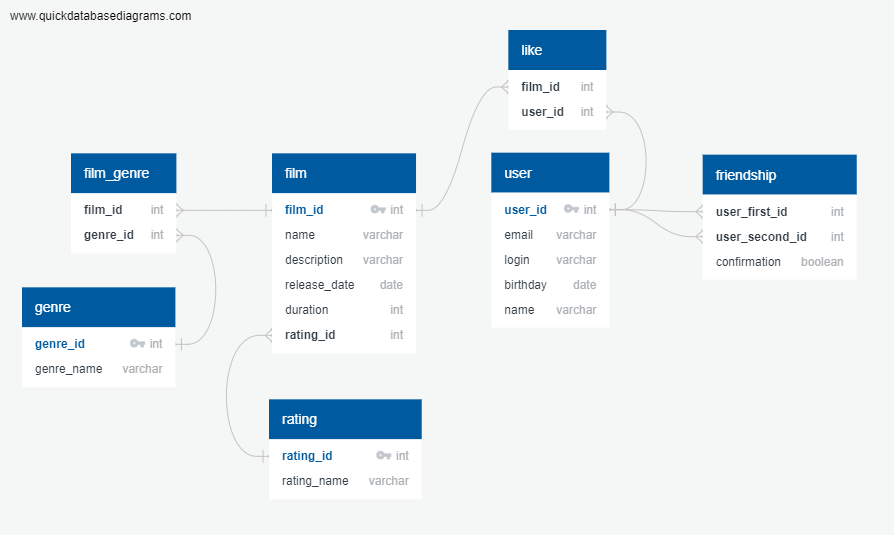

# java-filmorate
Repository for Filmorate project.
## Проект Filmorate
Filmorate project - Sprint 11.
### "Фильмо-рейтинг"
Приложение позволяет работать с поиском фильмов в базе данных, отмечать их, взаимодействовать с другими пользователями.
Что можно делать в программе:
1. Добавлять фильмы, ставить им лайки.
2. Добавлять пользователей, добавлять их в друзья, отслеживать их лайки.

Приложение создана на Java при помощи Spring и вспомогательных библиотек, подключена база данных с помощью JDBC.

#### ER-диаграмма базы данных для приложения:


##### Примеры запросов к базе данных:

Пример запроса:
Получение топ-10 названий фильмов по количеству лайков:
```sql
SELECT name
FROM film
WHERE film_id IN (SELECT film_id
                  FROM like
                  GROUP BY film_id
                  ORDER BY COUNT(user_id) desc
                   LIMIT 10);
```
Получение id и логинов друзей по id пользователя = 1:
```sql 
SELECT u.login,
       u.user_id
FROM user AS u
WHERE u.user_id IN (SELECT f.user_second_id
                    FROM friendship AS f
                    WHERE f.user_first_id = 1);
